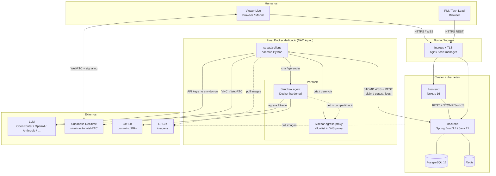
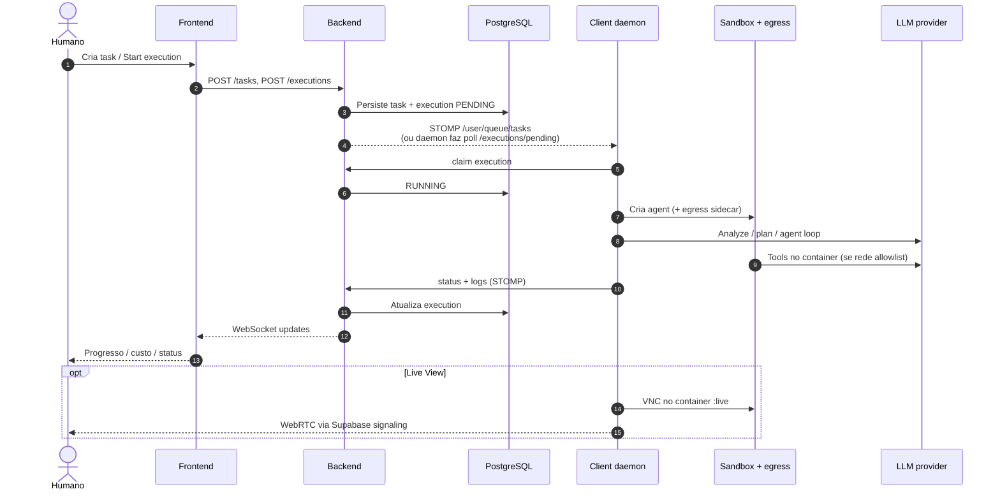
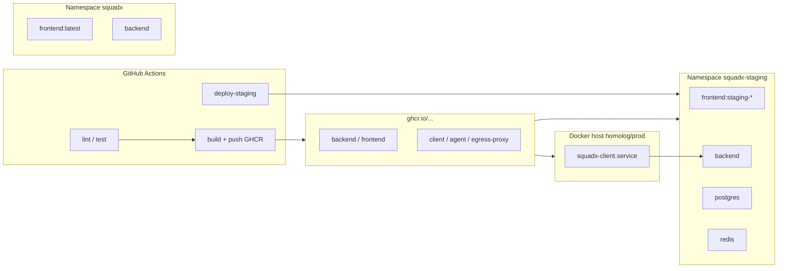
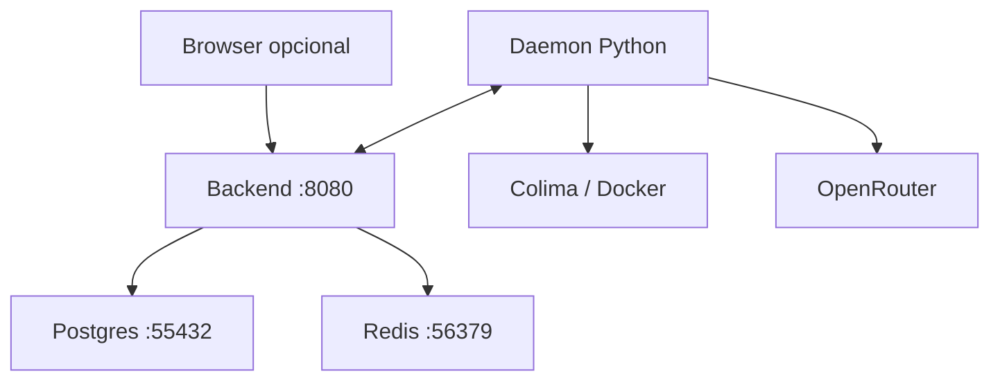

# Arquitetura de runtime — como o SquadX.dev roda

**Estado alvo (staging/prod):** cluster Kubernetes + host Docker dedicado.  
**Estado já exercitado em dev:** tudo local (Colima) com o mesmo fluxo lógico.

Precedência: **código > este doc > ARCHITECTURE.md (mais antigo/marketing)**.

---

## 1. Visão geral (como fica rodando)



### Papéis em uma frase

| Peça | Onde roda | Função |
|------|-----------|--------|
| **Frontend** | K8s (ou Vercel) | Kanban, settings, Live View UI |
| **Backend** | K8s | API, auth JWT, tasks/executions, STOMP, multi-tenant |
| **Postgres / Redis** | K8s | Estado + cache/filas leves |
| **Client daemon** | **Host com Docker** | Recebe tasks, sobe sandboxes, orquestra agentes |
| **Sandbox agent** | Containers no host | Código do agente (LangGraph ou CLI externa) |
| **Egress sidecar** | Container irmão | Firewall de saída (default-deny + allowlist) |
| **LLM** | SaaS | Inteligência (chaves no daemon / sandbox) |
| **Supabase** | Cloud | Sinalização do Live View (não é o “core” de tasks) |

---

## 2. Por que o client **não** fica no Kubernetes

O daemon precisa do **Docker do host** (`docker.from_env()`) para criar sandboxes irmãos + sidecar de rede.

Rodar isso *dentro* do cluster exigiria Docker socket no pod (quase root no node) ou DinD privilegiado. A arquitetura escolhida:

```text
  [ K8s: UI + API + DB ]  ──STOMP/WSS──►  [ Host: daemon + sandboxes ]
```

Código/docs: `client/deploy/README.md`.

---

## 3. Fluxo de uma task (runtime)



---

## 4. Staging vs produção (deploy)



| Ambiente | Namespace | Frontend image | Hosts (alvo) |
|----------|-----------|----------------|--------------|
| Staging | `squadx-staging` | `frontend:staging-<sha>` | `staging.squadx.dev`, `api.staging.squadx.dev` |
| Prod | `squadx` | `frontend:<sha>` / `latest` | `squadx.dev`, `api.squadx.dev` |

`NEXT_PUBLIC_*` é **build-time** → uma imagem de frontend por ambiente.

---

## 5. Dev local (o que já rodamos no smoke)

Mesmo fluxo lógico, colapsado numa máquina:



Docs: `documentos/HOMOLOGACAO-LOCAL-DOCKER.md`.

---

## 6. Camadas de segurança no sandbox (alvo)

```text
┌─ Host Docker ─────────────────────────────────────────┐
│  iptables DOCKER-USER: bloqueio metadata cloud (opt)  │
│  ┌─ egress-proxy (NET_ADMIN) ───────────────────────┐ │
│  │  dns-proxy + ipset allowlist                     │ │
│  │  default-deny egress                             │ │
│  └──────────────────────┬───────────────────────────┘ │
│  ┌─ agent (cap-drop ALL, non-root, seccomp, ro FS) ─┐ │
│  │  LangGraph / External CLI                        │ │
│  │  workspace / worktree git                        │ │
│  └──────────────────────────────────────────────────┘ │
└───────────────────────────────────────────────────────┘
```

---

## 7. O que *não* está no desenho de runtime atual

- **Control Panel / Pass 5 / MCP workspace** — spec e branches; não no `main` de runtime.
- Client como Deployment k8s — **desabilitado** (`client-deployment.yml.disabled`).
- gVisor / Firecracker como default — opt-in se o binário existir.

---

## Referências

- `CLAUDE.md` — monorepo e fluxo STOMP  
- `infra/k8s/README.md` — overlays staging/prod  
- `client/deploy/README.md` — host do daemon  
- `documentos/PILOTO-ESCOPO.md` — GO local vs NO-GO staging  
- `frontend/public/docs/architecture.svg` — diagrama estático do frontend  
